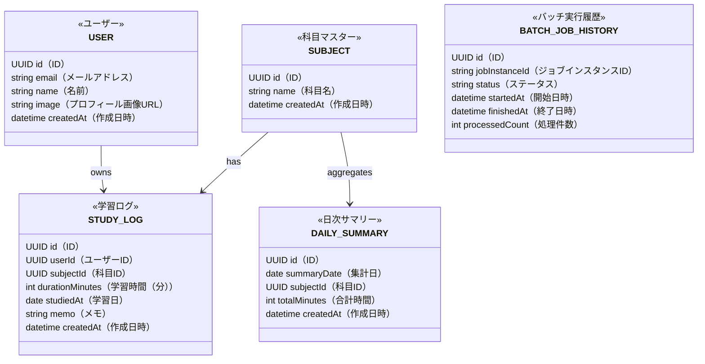

# 学習ログ＆バッチ分析アプリ 要件定義書

**バージョン：** 0.4
**更新日：** 2026年4月19日

---

## 1. プロジェクト概要

### 1.1 目的

日々の学習活動を記録・可視化し、Spring Batch による定期集計と Spring WebFlux によるリアルタイム通知を組み合わせることで、継続的な学習習慣の形成を支援する。

### 1.2 開発背景

- 個人の技術学習（Spring Batch・Spring WebFlux・Next.js・Zod）の習作として開発する
- 自身の学習管理にも実際に活用することを想定する

---

## 2. ユーザーと利用シナリオ

### 2.1 対象ユーザー

- 個人利用（開発者本人のみ）

### 2.2 主な利用シナリオ

1. Googleアカウントでログインしてアプリにアクセスする
2. 学習後に学習ログを登録する
3. ダッシュボードで今日・今週の学習時間を確認する
4. 毎朝、前日の集計サマリーをバッチで自動生成する
5. バッチ完了時、ブラウザ画面の隅にトースト通知が表示される
6. 月次サマリーをCSVファイルとしてダウンロードする

---

## 3. 機能要件

### 3.1 認証（Phase 1）

| #    | 機能               | 詳細                                                       |
| ---- | ------------------ | ---------------------------------------------------------- |
| F-00 | Googleログイン     | Auth.js v5 の Google OAuthプロバイダーを使用               |
| F-01 | ログアウト         | セッションを破棄してログアウトする                         |
| F-02 | 未認証リダイレクト | 未ログイン状態でのアクセスはログイン画面へリダイレクトする |

### 3.2 学習ログ管理（Phase 1）

| #    | 機能               | 詳細                                                       |
| ---- | ------------------ | ---------------------------------------------------------- |
| F-10 | ログ登録           | 科目（マスターから選択）・学習時間（分）・メモを登録できる |
| F-11 | ログ一覧           | 日付降順で一覧表示。日付・科目でフィルタできる             |
| F-12 | ログ編集           | 登録済みログを編集できる                                   |
| F-13 | ログ削除           | 登録済みログを削除できる                                   |
| F-14 | 入力バリデーション | Zodで学習時間・必須項目などを検証する                      |

### 3.3 科目マスター管理（Phase 1）

| #    | 機能     | 詳細                                                                             |
| ---- | -------- | -------------------------------------------------------------------------------- |
| F-20 | 科目一覧 | 登録済みの科目を一覧表示する                                                     |
| F-21 | 科目登録 | 科目名を新規登録できる                                                           |
| F-22 | 科目編集 | 科目名を編集できる                                                               |
| F-23 | 科目削除 | 科目を削除できる（ログが紐づいている場合は確認の上、関連ログもまとめて削除する） |

### 3.4 バッチ集計（Phase 3）

| #    | 機能            | 詳細                                                              |
| ---- | --------------- | ----------------------------------------------------------------- |
| F-30 | 日次集計バッチ  | 毎日0時に前日の学習ログを科目別に集計しサマリーテーブルへ書き込む |
| F-31 | CSVダウンロード | 指定月の学習ログをCSVファイルとしてダウンロードする               |
| F-32 | バッチ実行履歴  | ジョブの実行日時・ステータス・処理件数を確認できる                |
| F-33 | 手動バッチ実行  | 画面から任意のタイミングでバッチジョブを手動実行できる            |

### 3.5 リアルタイム通知（Phase 4）

| #    | 機能                  | 詳細                                                                                                 |
| ---- | --------------------- | ---------------------------------------------------------------------------------------------------- |
| F-40 | SSEによるログ登録通知 | ログ登録時にダッシュボードの数値をリアルタイムで更新する                                             |
| F-41 | バッチ完了通知        | バッチジョブ完了時にブラウザ画面の隅にトースト通知を表示する（ログアウト中のバッチ完了は通知対象外） |

### 3.6 ダッシュボード

| #    | 機能           | 詳細                                 |
| ---- | -------------- | ------------------------------------ |
| F-50 | 今日の学習時間 | 本日の合計学習時間を表示する         |
| F-51 | 今週の学習時間 | 週次の科目別積み上げグラフを表示する |
| F-52 | 月次サマリー   | バッチ集計結果をグラフ表示する       |

---

## 4. 非機能要件

### 4.1 パフォーマンス

- ログ一覧の表示は1秒以内（個人利用のため件数は最大1,000件程度を想定）

### 4.2 セキュリティ

- Auth.js v5（旧NextAuth.js）によるGoogle OAuthログインを実装する
- 全ページ・全APIエンドポイントをログイン必須とする
- APIはインターネット公開環境を想定する

### 4.3 可用性

- 個人開発のため高可用性は不要
- バッチ失敗時は手動での再実行で対応

---

## 5. データモデル（概要）

```
User（ユーザー）
  - id
  - email
  - name
  - image（Googleプロフィール画像URL）
  - createdAt

Subject（科目マスター）
  - id
  - name（科目名）
  - createdAt

StudyLog（学習ログ）
  - id
  - userId（ユーザーへの外部キー）
  - subjectId（科目マスターへの外部キー）
  - durationMinutes（学習時間）
  - studiedAt（学習日）
  - memo（メモ）
  - createdAt

DailySummary（日次サマリー）
  - id
  - summaryDate（集計日）
  - subjectId（科目）
  - totalMinutes（合計時間）
  - createdAt

BatchJobHistory
  ※ Spring Batch標準テーブル（BATCH_JOB_INSTANCE等）を利用
```

## 5.1 ER図



---

## 6. 技術スタック

| レイヤー             | 技術                         | 備考                                           |
| -------------------- | ---------------------------- | ---------------------------------------------- |
| フロントエンド       | Next.js（App Router）、Zod   |                                                |
| 認証                 | Auth.js v5（旧NextAuth.js）  | Google OAuthプロバイダー使用                   |
| バックエンドAPI      | Spring Boot + Spring WebFlux | REST APIサーバー                               |
| バッチ               | Spring Batch                 | WebFluxと同一アプリに同居（習作のため）        |
| DBアクセス           | Spring Data / Spring R2DBC   | Java 側で DB を扱う                            |
| DB                   | PostgreSQL                   |                                                |
| インフラ（ローカル） | Docker Compose               | PostgreSQLをコンテナで起動                     |
| インフラ（本番）     | Google Cloud Run             | フロント・バックエンドそれぞれコンテナデプロイ |

---

## 7. システム構成（概要）

```
[ブラウザ]
    ↕ REST API / SSE（直接呼び出し）
    ├── [Next.js]（フロントエンド + Auth.js v5）
    │       ↕ REST API
    └── [Spring Boot]（REST APIサーバー）
            ├── WebFlux（APIレイヤー・SSEエンドポイント）
            └── Spring Batch（スケジューラー）
                    ↕
               [PostgreSQL]
```

---

## 8. 開発フェーズ

| フェーズ | 内容                                                       | 習得技術                    |
| -------- | ---------------------------------------------------------- | --------------------------- |
| Phase 1  | 認証・学習ログ・科目マスターCRUD（フロントと API 連携）    | Next.js、Zod、Auth.js v5    |
| Phase 2  | Spring WebFluxによるREST APIサーバー構築、フロントとの結合 | Spring WebFlux、Spring Boot |
| Phase 3  | バッチ集計・CSVダウンロード                                | Spring Batch                |
| Phase 4  | リアルタイム通知（SSE）                                    | Spring WebFlux（応用）      |

---

## 9. 未決事項（TODO）

なし（すべて決定済み）

---

## 10. 画面設計

@doc/SCREEN_DEFINITION.md

---

## 11. API仕様書

@doc/API_SPEC.md

---

## 12. テスト仕様書

@doc\TEST_SPEC.md
